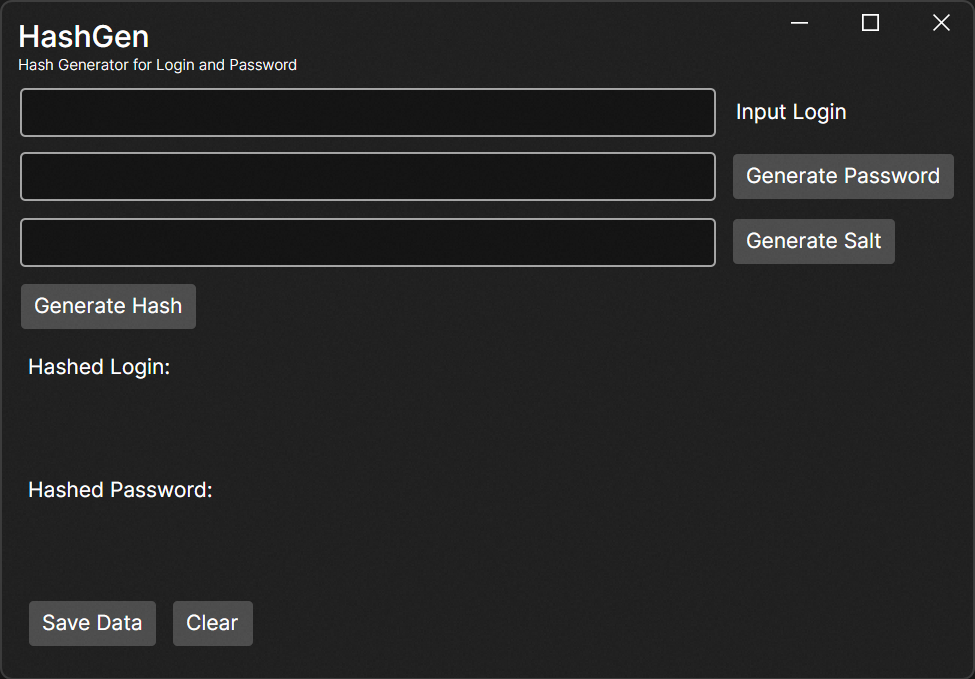
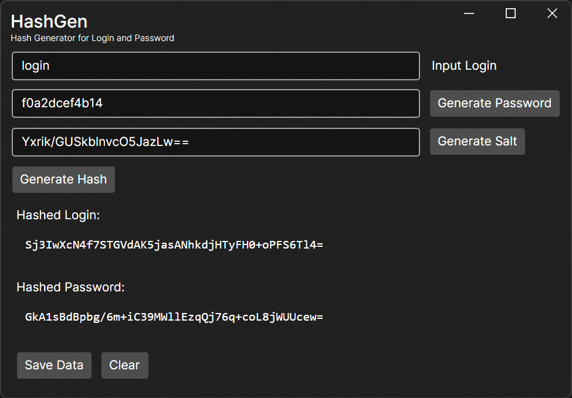

# HashGen

### Простой генератор хэшей для тестирования

Версия на английском доступна в файле [README.md](README.md)

## О приложении

`HashGen` был создан для тестирования алгоритма хеширования данных перед сохранением их на сервере. Я хотел убедиться, что алгоритм выдаёт одинаковые результаты при многократном использовании.
Поэтому я создал это приложение на `Avalonia`, где я могу ввести строку для входа, ввести или сгенерировать пароль и соль для лучшего хеширования.

Кроме того, я хотел сохранить эти данные в файле `json`, поэтому я добавил функцию сохранения всех этих данных в файл.

## Установите приложение

В разделе `Release` есть скомпилированная версия приложения с расширением `.tar`. Просто скачайте её, распакуйте и запустите `HashGen.Desktop.exe` 

Если вы хотите изменить алгоритм хеширования:
- скачайте/клонируйте исходный код
- перейдите в `MainVewModel.cs` 
- измените алгоритм в методе `GenerateHash`.

## Использование приложения

После запуска откроется следующее окно:

Заполнение полей:
1) Введите свой логин
2) Введите свой пароль или сгенерируйте новый, нажав кнопку
3) Введите свою соль или сгенерируйте новую, нажав кнопку
4) Нажмите кнопку `GenerateHash` => поля `Hashed Login` и `Hashed Password` будут заполнены сгенерированными данными.
5) (Необязательно) Вы можете сохранить свои данные в файл `json`, нажав `Save Data` => выберите место назначения в открывшемся окне и перейдите в нужную папку. После этого `UserData.json` будет сохранен там.

Итоговый результат будет выглядеть так:

## Лицензия

Этот проект имеет лицензию `MIT`.

## Контакты

Вы можете открыть проблему, если обнаружите какие-либо ошибки или захотите что-то изменить.

Или просто напишите мне в [Telegram](https://t.me/Alexey_G_M)
