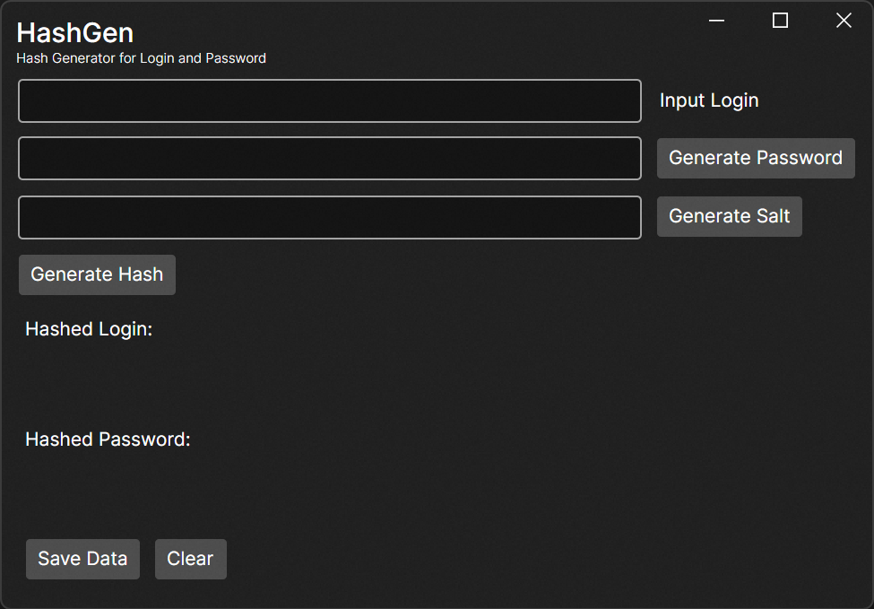
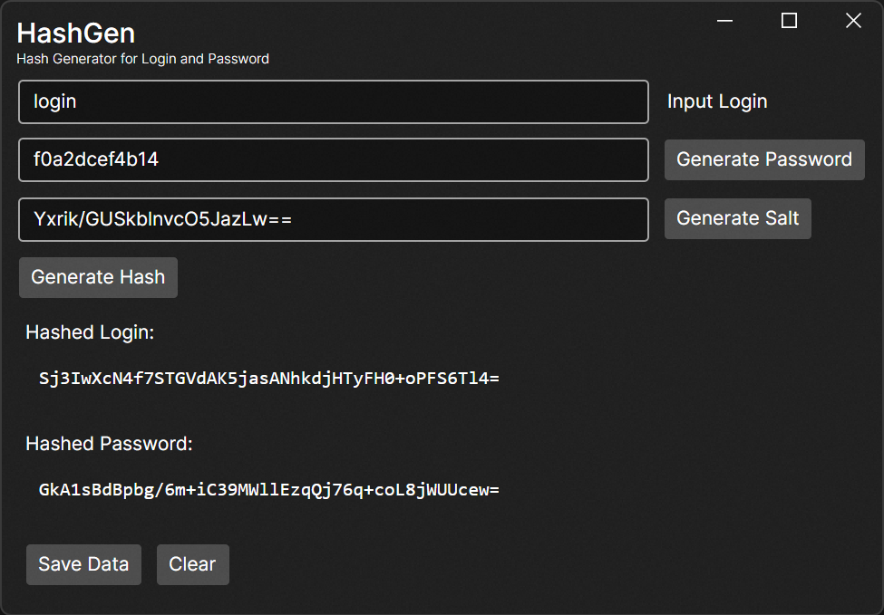

# HashGen
### A simple hash generator for testing purposes

> Для просмотра Readme на русском посмотрите файл [README.RU.md](README.RU.md)

## About

HashGen was created to test algorhytm of hashing data before saving it to server. I wanted to be sure that the algorythm with make the same results for multiple times.
So, I've built this app on avalonia, where I can enter login string, enter or generate password and salt for better hasing.

More of that, I wanted to save this data in `json` file so I've made a feature for saving all this data into file.

## Install the app

In the release section there is a compiled version of the app with .tar extension. Just download it, unpack and launch `HashGen.Desktop.exe` 

If you want to change an algorythm of hashing:
- download/clone source code
- proceed to `MainVewModel.cs` 
- chage the algorhytm in GenerateHash method.

## Using app

After launch following window will be opened:

Filling fields:
1) Input your login
2) Input your password or generate new one by clicking the button
3) Input ypur salt generate new one by clicking the button
4) Press the button Generate Hash => HashedLogin and HashedPassword fields will be filled by geenerated data.
5) (Optional) You may save your data to `json` file by clicking `Save Data` => choose destination in opened window and follow to desired folder. After that `UserData.json` will be saved there.

Final view will look like:

## Licence

This project has an `MIT` license.

## Contacts

You may open an issue if some bugs found or you'd like to modify something.

Or just PM me via [Telegram](https://t.me/Alexey_G_M)
